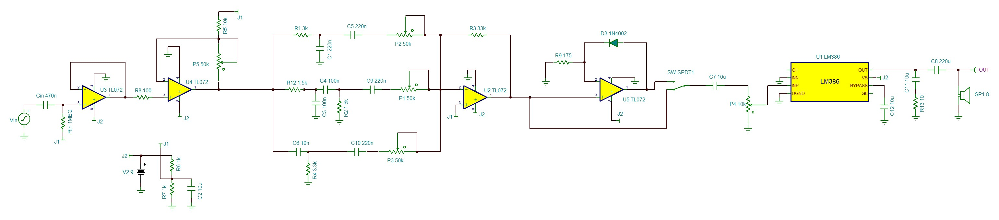

# GuitarAmplifier-PCB-IE0308

Repositorio para el proyecto final del curso IE0308 sobre el diseño de una PCB de un amplificador para guitarra. Contiene el circuito esquemático, el diseño de la PCB en *KiCad* y documentación sobre los componentes a utilizar, el procedimiento de diseño y otros detalles. 

Este repositorio y sus contenidos fueron diseñados durante el curso IE0308 durante el periodo I-2025 por los siguientes integrantes del equipo:

|        **Integrantes**      | **Carné** | **Correo electrónico**|
|:---------------------------:|:---------:|:---------------------:|
|    Anthony Calvo García     |   C11433  |  anthonycalvo50@gmail.com |
|   Rodrigo Madrigal Montes   |   C24458  | rmadrigalmontes@gmail.com |

## Agradecimientos a PCBWay

Queremos expresar nuestro agradecimiento a **PCBWay** por su colaboración y apoyo en la fabricación de nuestras PCBs. La calidad de las placas recibidas, tanto en precisión de fabricación como en acabados, fue sobresaliente. Todo el proceso —desde la carga de archivos hasta la recepción del paquete— fue ágil, transparente y eficiente.

### PCB ensamblada

Una vez recibidas las placas de **PCBWay**, se procedió con el ensamblaje manual de todos los componentes. A continuación se muestran imágenes del resultado final:

|  |
|:--:|
| *PCB ensamblada - vista frontal* |

|  |
|:--:|
| *PCB ensamblada - vista isométrica* |

Gracias a su servicio confiable, logramos ensamblar y probar con éxito nuestro amplificador, cumpliendo los objetivos del proyecto. Recomendamos sus servicios para estudiantes, profesionales o cualquier persona interesada en manufacturar PCBs de alta calidad. Más información en [pcbway.com](https://www.pcbway.com).

## Organización y contenido de los directorios 

Este repositorio contiene dos directorios principales, cuyos contenidos son:

- `kicad_project`: Contiene los archivos del esquemático, PCB y la configuarción del proyecto
    - `CargadorWalkieTalkie.kicad_pcb`
    - `CargadorWalkieTalkie.kicad_pro`
    - `CargadorWalkieTalkie.kicad_sch`

- `outputs`: Contiene todos los archivos de salida de *KiCad*

Si se desea utilizar este diseño y manufacturarlo por medio de un fabricante se deben comprimir los archivos incluidos en la carpeta `outputs` en un archivo `.zip` y este se puede cargar en la página del fabricante para ordenar la fabricación de la PCB.

## Circuito base

El circuito completo del que partimos para diseñar la PCB fue primeramente fue armado y simulado en el simulador *Tina-TI*:

|  |
|:--:|
| *Circuto completo del diseño* |

> [!NOTE]
> La documentación detallada de funcionamiento de cada etapa del circuito, elección de componentes, y consideraciones de diseño está disponible en la documentación adicional asociada al proyecto (ver `Wiki` de este repostitorio).

### Lista de componentes

A continuación se incluye una lista con los principales componentes utilizados en el diseño:

|   Componente   |   Valor / Modelo    |    Descripción    |
|:--------------:|:-------------------:|:-----------------:|
| Ejemplo: R1    |     10 kΩ           |   Resistencia     |
| Ejemplo: C2    |     100 nF          | Capacitor cerámico |
| Ejemplo: U1    |     TL072CP         | Amplificador operacional |
| Ejemplo: U2    |     LM386           | Amplificador de potencia |

## Diseño de la PCB

Una vez definido el circuito final, se diseñó la PCB en *KiCad* con una arquitectura de **cuatro capas**:

- **F.Cu**: Ruta de señales superiores
- **In1.Cu**: Plano de alimentación (+9V y +4.5V)
- **In2.Cu**: Plano de tierra (GND)
- **B.Cu**: Ruta de señales inferiores

Además, se agregaron zonas de serigrafía, agujeros de montaje, y textos identificativos en silkscreen con el nombre del proyecto y los autores.

|  |
|:--:|
| *Vista 3D de la PCB en KiCad* |

### Capas de la PCB

|  |
|:-----------------------------:|
|    *Capa superior (F.Cu)*     |

|  |
|:-----------------------------:|
|    *Capa inferior (B.Cu)*     |

|  |
|:-------------------------------------------:|
|      *Capa interna 1 - +9V / +4.5V*         |

|  |
|:-------------------------------------:|
|        *Capa interna 2 - GND*         |

